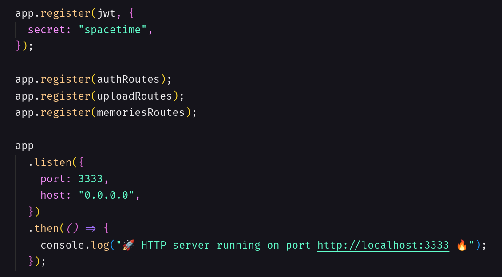

<div align="center" id="top">
  

  &#xa0;
</div>

<h1 align="center">NLW 12 - Spacetime - api</h1>

<p align="center">
  
  <a href="LICENSE"></a>
</p>

<p align="center">
  

  

  

  

</p>

<hr>

<p align="center">
  <a href="#balloon-sobre">Sobre</a> &#xa0; | &#xa0;
  <a href="#sparkles-funcionalidades">Funcionalidades</a> &#xa0; | &#xa0;
  <a href="#rocket-tecnologias">Tecnologias</a> &#xa0; | &#xa0;
  <a href="#white_check_mark-requisitos">Requisitos</a> &#xa0; | &#xa0;
  <a href="#checkered_flag-iniciando">Iniciando</a> &#xa0; | &#xa0;
  <a href="#memo-licen%C3%A7a">Licença</a> &#xa0; | &#xa0;
  <a href="https://andrelino.dev" target="_blank">Autor</a>
</p>

<br>

## :balloon: Sobre ##

A aplicação "SpaceTime" foi desenvolvida pela Rocketseat durante o evento Next Level Week (NLW) #12. O projeto é voltado para o gerenciamento de eventos, onde os usuários podem criar, editar, visualizar sua timeline com fotos e vídeos organizados por mês e ano.

O código nesta pasta refere-se à parte do servidor da aplicação. Aqui está uma descrição básica da aplicação:

A aplicação é desenvolvida usando [Node.js](https://nodejs.org) e [TypeScript](https://www.typescriptlang.org/). Node.js é uma plataforma de execução JavaScript do lado do servidor e TypeScript é um superset do JavaScript que adiciona recursos de tipagem estática ao código.

- A aplicação utiliza o [Fastify](https://www.fastify.io/), um framework web rápido e eficiente para Node.js. Ele foi desenvolvido com foco na velocidade de execução e baixa sobrecarga. Fastify é conhecido por seu desempenho excepcionalmente alto em comparação com outros frameworks similares.

Em resumo, o Fastify é uma ótima escolha para o desenvolvimento de aplicativos web rápidos e de alto desempenho em Node.js, com uma abordagem modular e extensível que permite aos desenvolvedores criar APIs robustas de forma eficiente.

- A persistência de dados é feita usando o [Prisma](https://www.prisma.io/), que é um ORM (Object-Relational Mapping) para Node.js. O Prisma simplifica a interação com o banco de dados, permitindo que os desenvolvedores usem uma abordagem baseada em modelos para trabalhar com dados.

- O banco de dados utilizado é o [SQLite](https://www.sqlite.org/index.html), que é um banco de dados relacional leve e incorporado, adequado para **desenvolvimento e testes**. No entanto, o Prisma é flexível e pode ser configurado para trabalhar com outros bancos de dados populares, como MySQL, PostgreSQL, entre outros.

- A aplicação possui várias rotas e controladores que lidam com diferentes operações, como criação e atualização de eventos, autenticação de usuários, entre outras que pode ser adicionadas.

- A autenticação é implementada usando tokens [JWT](https://jwt.io/) (JSON Web Tokens), que são utilizados para verificar a identidade dos usuários e permitir o acesso a determinadas funcionalidades da aplicação.

- A estrutura do projeto segue um padrão MVC (Model-View-Controller), onde os modelos representam a estrutura de dados, as visualizações são responsáveis pela apresentação dos dados ao usuário e os controladores tratam as solicitações e as operações relacionadas ao servidor.

- Além disso, a aplicação possui configurações de ambiente usando a biblioteca [dotenv](https://www.npmjs.com/package/dotenv), que permite a leitura de variáveis de ambiente a partir de um arquivo .env, tornando mais fácil a configuração de valores sensíveis, como chaves de API e informações de conexão com o banco de dados.

Para mais detalhes e entender melhor as funcionalidades e a estrutura completa da aplicação explore mais o diretório da api.

## :sparkles: Funcionalidades ##

- [x] Listar e visualizar memórias(eventos) salvas;
- [x] Inserir novas memórias;
- [x] Acesso autenticado;
- [ ] Visualizar memórias únicas;
- [ ] Inserir data e hora específicas para uma memória;
- [ ] Editar memórias salvas;
- [ ] Remover memórias;
- [ ] Buscar por memórias com base no título ou data;
- [ ] Link para compartilhar memórias;
- [ ] Curtir uma memória;
- [ ] Se inscrever para receber novas memórias;
- [ ] Bloquear memória para alguns usuários;

## :rocket: Tecnologias ##

- [Node.js](https://nodejs.org/en/)
- [Fastify](https://www.fastify.io/)
- [TypeScript](https://www.typescriptlang.org/)
- [Prisma](https://www.prisma.io/)
- [JWT](https://jwt.io/)
- [axios](https://axios-http.com/)

## :white_check_mark: Requisitos ##

Antes de iniciar, você precisa ter instalado em seu sistema o [Git](https://git-scm.com) e o [Node](https://nodejs.org/).

## :checkered_flag: Iniciando ##

```bash
# Clone o repositório principal
$ git clone https://github.com/andrelinos/nlw-12-spacetime-ignite-server

# Acessa a pasta
$ cd server

# Instale as dependências
$ npm i

# Faça a migração do projeto
$ npx prisma migrate dev

# Execute a aplicação back-end
$ npm run dev

# O servidor estará disponível em: <http://localhost:3333>
```

**Nota**: Você deverá adicionar ao seu arquivo .env as informações necessárias para que a aplicação funcione corretamente seguindo o padrão do arquivo .env.example.

## :memo: Licença ##

Este projeto está sob a licença MIT. Para mais detalhes acesse [LICENSE](LICENSE)

<p align="center">
  
</p>

Feito com :heart: por <a href="https://andrelino.dev" target="_blank">Andrelino Silva</a>

&#xa0;

<a href="#top">Voltar ao topo</a>
